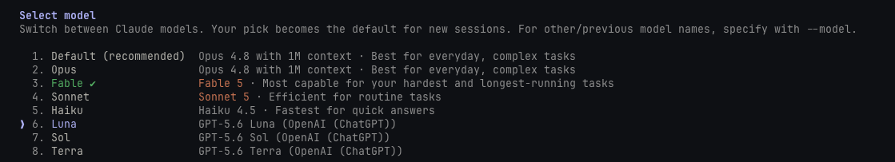

# Leverframe

Leverframe bridges Claude Code to OpenAI-compatible providers while preserving Claude Code tools, skills, agents, prompt caching, model switching, and auto-compaction.

Supported provider setups include:

- OpenAI API keys
- ChatGPT/Codex plan OAuth
- Kimi Coding Plan
- Moonshot pay-as-you-go
- z.ai Coding Plan
- custom OpenAI-compatible endpoints

Leverframe can also run as a local Anthropic-format or OpenAI-compatible endpoint for other clients.



## Install from a checkout

Node.js 22 or newer and pnpm are required.

```bash
pnpm install
pnpm build
npm link
leverframe --version
```

The package name is `@michaelheichler/leverframe`. It installs the `leverframe` and `leverframe-claude` bins. There is no old-name executable alias.

## Quick start

### ChatGPT/Codex plan

```bash
leverframe providers auth openai
leverframe models
leverframe models --alias sol=leverframe:openai-oauth:gpt-5.6-sol
leverframe patch
leverframe claude
```

### API-key providers

```bash
leverframe providers add
leverframe models
leverframe claude
```

`providers add` supports OpenAI, Kimi Coding Plan, Moonshot, z.ai Coding Plan, and custom OpenAI-compatible endpoints. Credentials stay separate because each provider has its own endpoint and billing arrangement.

## Model routes

The public route format is:

```text
leverframe:<provider-id>:<model-id>
```

Examples:

```text
leverframe:openai:gpt-5.4
leverframe:openai-oauth:gpt-5.6-sol
leverframe:kimi:k3
leverframe:moonshot:kimi-k3
leverframe:zai:glm-5.2
```

Aliases can replace a full route after being saved with `leverframe models --alias`.

## Bridge modes

Both `leverframe claude` and `leverframe server` default to proxy mode. A mode flag applies only to the current run unless paired with `--save-mode`.

- `--proxy`: selectively intercepts requests to `api.anthropic.com`. Anthropic models and Claude Code credentials pass through untouched. `leverframe:` routes and saved aliases go to their configured providers.
- `--endpoint`: runs a local Anthropic-format gateway and launches Claude Code with `ANTHROPIC_BASE_URL` pointed at it.

The Anthropic passthrough base URL is kept unchanged. Gateway and proxy responses echo the exact model id supplied by the requesting client.

```bash
leverframe claude --proxy
leverframe claude --endpoint
leverframe server --proxy
leverframe server --endpoint --quick
```

Endpoint-mode defaults:

```text
ANTHROPIC_BASE_URL=http://127.0.0.1:17645/anthropic
OPENAI_BASE_URL=http://127.0.0.1:17645/openai/v1
```

Use any API key for a local-only endpoint. Network listen mode requires the configured server password.

## Commands

```text
leverframe claude [options] [claude-flags]
leverframe server [options]
leverframe patch [--restore]
leverframe models
leverframe favorites
leverframe providers [add|auth|list|remove|refresh-models]
```

`leverframe patch` makes favorites and aliases first-class Claude Code models. It updates model validation, the `/model` picker, aliases, and context-window metadata. Re-run it after a Claude Code update.

For agents view and background-agent setup, see [docs/background-agents.md](docs/background-agents.md).

## Configuration and compatibility

- Config home: `~/.leverframe`, overridden by `LEVERFRAME_HOME`.
- Logs, runtime discovery, locks, patch state, certificates, and fallback credential data live under `~/.leverframe`.
- `LEVERFRAME_CLAUDE_PATH` overrides Claude Code binary discovery.
- `LEVERFRAME_NO_DISCOVERY=1` prevents a standalone server from registering in `~/.leverframe/server-runtime.json`.
- Provider-specific environment keys use `LEVERFRAME_KEY_<PROVIDER_ID>`.
- Credentials use the OS credential store service `leverframe`.

On the first normal run, if `~/.leverframe` does not exist, Leverframe copies persisted state from legacy `~/.clodex` without changing or deleting the source. It can also read older relay-ai state. Credential lookup checks the `leverframe` keychain service, then legacy `clodex`, then `relay-ai`, and copies the first legacy hit into `leverframe`.

## Known limitations

- Claude Code applies its own pricing table, so its displayed cost can be inaccurate for non-Anthropic models.
- In endpoint mode, Claude Code fetches context metadata at startup and may not refresh it after a live `/model` switch.
- ChatGPT/Codex OAuth requires `store: false` upstream. Some OpenAI cache controls are omitted on OAuth routes because compatibility testing found empty responses with them.

## Provenance and license

Leverframe is MIT-derived from [clodex](https://github.com/bman654/clodex) and [relay-ai](https://github.com/jacob-bd/relay-ai). See [LICENSE](LICENSE) for the license and required copyright notices.
